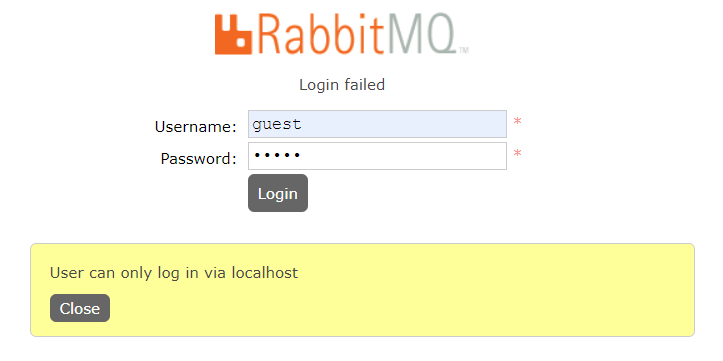

##### 开放防火墙端口

```$ firewall-cmd --zone=public --add-port=5672/tcp --permanent```

```$ firewall-cmd --zone=public --add-port=15672/tcp --permanent```

```$ firewall-cmd --zone=public --add-port=25672/tcp --permanent```

```$ firewall-cmd --zone=public --add-port=4369/tcp --permanent```

```$ sudo firewall-cmd --reload```


### 方法一：步骤安装

##### 1、创建目录

```$ mkdir -p /usr/java```

```$ cd /usr/java```

##### 2、安装erlang

erlang在安装前需要先安装下它的依赖工具:

```$ sudo yum -y install make gcc gcc-c++ kernel-devel m4 ncurses-devel openssl-devel unixODBC-devel```


[官网下载](http://www.erlang.org/downloads) erlang源码包，或者用wget获取：

```$ wget http://erlang.org/download/otp_src_21.2.tar.gz```


```$ tar -xvzf otp_src_21.2.tar.gz```

```$ cd otp_src_21.2```


```$ ./configure --prefix=/usr/java/erlang --without-javac```

--prefix=/usr/erlang 是说明将当前的安装放在usr/erlang文件夹下。


```$ make```

```$ make install```

安装 make install 。安装完成后会有一个erlang文件夹。otp_src_21.2和otp_src_21.2.tar.gz都可以删除了。


测试：```$ ./bin/erl```

##### 3、配置环境变量

```$ sudo vi /etc/profile```

```
# erlang env
export ERLANG_HOME=/usr/java/erlang/
export PATH=$ERLANG_HOME/bin:$PATH
```

```$ source /etc/profile```


##### 4、rpm方式安装rabbitmq

```$ wget https://dl.bintray.com/rabbitmq/rpm/rabbitmq-server/v3.7.x/el/7/noarch/rabbitmq-server-3.7.11-1.el7.noarch.rpm```

下载完成后依旧照着[文档](https://www.rabbitmq.com/install-rpm.html)走先执行下：

```$ rpm --import https://packagecloud.io/rabbitmq/rabbitmq-server/gpgkey```

```$ yum install -y rabbitmq-server-3.7.11-1.el7.noarch.rpm```

上面的方法有毒。。。。

##### 5、使用编译过的包安装rabbitmq

```$ wget https://dl.bintray.com/rabbitmq/all/rabbitmq-server/3.7.11/rabbitmq-server-generic-unix-3.7.11.tar.xz```

```$ xz -d rabbitmq-server-generic-unix-3.7.11.tar.xz```
```$ tar -xvf rabbitmq-server-generic-unix-3.7.11.tar```
```$ mv rabbitmq_server-3.7.11/ rabbitmq```

- 设置环境变量
```$ vi /etc/profile```
```
# Rabbitmq Env
export RABBITMQ_HOME=/usr/java/rabbitmq
export PATH=$PATH:${RABBITMQ_HOME}/sbin
```
```$ source /etc/profile```
- 配置
在rabbitmq/sbin/rabbitmq-defaults 文件中，CONFIG_FILE变量指定了配置文件的位置，CONF_ENV_FILE指定了rabbitmq-env.conf文件的位置
```
CONFIG_FILE=/usr/java/rabbitmq/etc/rabbitmq/rabbitmq
CONF_ENV_FILE=/usr/java/rabbitmq/etc/rabbitmq/rabbitmq-env.conf
```
按照位置创建配置文件：```$ touch /usr/java/rabbitmq/etc/rabbitmq/rabbitmq.config``` 
rabbitmq.config内容[范例](https://github.com/rabbitmq/rabbitmq-server/blob/master/docs/rabbitmq.config.example)
按照位置创建配置文件：```$ touch /usr/java/rabbitmq/etc/rabbitmq/rabbitmq-env.conf``` 
rabbitmq-env.conf内容：

```
RABBITMQ_MNESIA_BASE=/usr/java/rabbitmq/data
RABBITMQ_LOG_BASE=/usr/java/rabbitmq/logs
```
```$ mkdir -p /usr/java/rabbitmq/data```
```$ mkdir -p /usr/java/rabbitmq/logs```

启动：```$ rabbitmq-server```
开启web管理插件：```$ rabbitmq-plugins enable rabbitmq_management```

登录遇到问题：User can only log in via localhost
找到rabbit.app ```vi /usr/rabbitmq/ebin/rabbit.app```
```
将：{loopback_users, [<<”guest”>>]}，
改为：{loopback_users, []}，
```

- 添加到服务
脚本见末尾 或 [参考](https://blog.csdn.net/weiguang1017/article/details/79065486)
出现问题服务启动不了
```$ cat /var/log/rabbitmq/startup_err```
```shell
[root@centos-100 panqt]# cat /var/log/rabbitmq/startup_err
/usr/java/rabbitmq/sbin/rabbitmq-server:行187: erl: 未找到命令
```
因为脚本中没有导入erlang环境变量，导入即可


### 方法二：配置yum源式安装

```$ vi /etc/yum.repos.d/rabbitmq-erlang.repo```

```
[rabbitmq-erlang]
name=rabbitmq-erlang
baseurl=https://dl.bintray.com/rabbitmq/rpm/erlang/21/el/7
gpgcheck=1
gpgkey=https://dl.bintray.com/rabbitmq/Keys/rabbitmq-release-signing-key.asc
repo_gpgcheck=0
enabled=1
```


```$ vi /etc/yum.repos.d/rabbitmq-server.repo```

```
[bintray-rabbitmq-server]
name=bintray-rabbitmq-rpm
baseurl=https://dl.bintray.com/rabbitmq/rpm/rabbitmq-server/v3.7.x/el/7/
gpgcheck=0
repo_gpgcheck=0
enabled=1
```


显示可安装的程序包：

```$ yum list available rabbitmq-server```

```$ yum list available erlang```


安装：```$ yum install -y rabbitmq-server```

一个命令就可以把erlang和rabbitmq都安装好


**yum源式安装配置：**

```$ cd /etc/rabbitmq```

```$ vi rabbitmq-env.conf```

```
RABBITMQ_MNESIA_BASE=/usr/rabbitmq/rabbitmq-server/data
RABBITMQ_LOG_BASE=/usr/rabbitmq/rabbitmq-server/logs
```

```$ mkdir -p /usr/rabbitmq/rabbitmq-server/data```

```$ mkdir -p /usr/rabbitmq/rabbitmq-server/logs```

```$ chmod -R 777 /usr/rabbitmq```


对于rabbitmq.config配置文件的样本可以在/usr/share/doc/rabbitmq-server/ 或者 /usr/share/doc/rabbitmq-server-3.7.13/里找到，就是一个rabbitmq.config.example的文件，去掉.example即可使用，RabbitMQ平时使用默认配置即可

```$ cp /usr/share/doc/rabbitmq-server-3.7.13/rabbitmq.config.example /etc/rabbitmq/rabbitmq.config```


然后保存安装下RabbitMQ服务

```$ rabbitmq-server install```


启动RabbitMQ服务可以通过命令：```$ rabbitmq-server start```

添加rabbitmq到启动项可以通过命令：```$ chkconfig rabbitmq-server on```

还有就是开启管理界面可以通过命令：```$ rabbitmq-plugins enable rabbitmq_management ```


访问管理服务：http://192.168.200.100:15672/

出现错误：User can only log in via localhost

解决办法：https://blog.csdn.net/shenhonglei1234/article/details/82745601


##### 服务脚本：
```shell
#!/bin/sh
# chkconfig: 2345 80 05
# rabbitmq-server RabbitMQ broker

 
# Source function library.
. /etc/init.d/functions
export HOME=/root
ERLANG_HOME=/usr/java/erlang
PATH=${ERLANG_HOME}/bin:$PATH


DAEMON=/usr/java/rabbitmq/sbin/rabbitmq-server
CONTROL=/usr/java/rabbitmq/sbin/rabbitmqctl

USER=root
ROTATE_SUFFIX=
INIT_LOG_DIR=/usr/java/rabbitmq/log
PID_FILE=/var/run/rabbitmq/pid
 
START_PROG="daemon"
LOCK_FILE=/var/lock/subsys/rabbitmq-server
 
test -x $DAEMON || exit 0
test -x $CONTROL || exit 0
 
RETVAL=0
set -e
 
[ -f /etc/default/rabbitmq-server ] && . /etc/default/rabbitmq-server
 
ensure_pid_dir () {
    PID_DIR=`dirname ${PID_FILE}`
    if [ ! -d ${PID_DIR} ] ; then
        mkdir -p ${PID_DIR}
        chown -R ${USER}:${USER} ${PID_DIR}
        chmod 755 ${PID_DIR}
    fi
}
ensure_init_log_dir () {
    if [ ! -d ${INIT_LOG_DIR} ] ; then
        mkdir -p ${INIT_LOG_DIR}
        chown -R ${USER}:${USER} ${INIT_LOG_DIR}
        chmod 755 ${INIT_LOG_DIR}
    fi
}
remove_pid () {
    rm -f ${PID_FILE}
    rmdir `dirname ${PID_FILE}` || :
}
 
start_rabbitmq () {
    status_rabbitmq quiet
    if [ $RETVAL = 0 ] ; then
        echo RabbitMQ is currently running
    else
        RETVAL=0
        ensure_pid_dir
        ensure_init_log_dir
        set +e
        RABBITMQ_PID_FILE=$PID_FILE $START_PROG $DAEMON \
            > "${INIT_LOG_DIR}/startup_log" \
            2> "${INIT_LOG_DIR}/startup_err" \
            0<&- &
        $CONTROL wait $PID_FILE >/dev/null 2>&1
        RETVAL=$?
        set -e
        case "$RETVAL" in
            0)
                echo SUCCESS
                if [ -n "$LOCK_FILE" ] ; then
                    touch $LOCK_FILE
                fi
                ;;
            *)
                remove_pid
                echo FAILED - check ${INIT_LOG_DIR}/startup_\{log, _err\}
                RETVAL=1
                ;;
        esac
    fi
}
 
stop_rabbitmq () {
    status_rabbitmq quiet
    if [ $RETVAL = 0 ] ; then
        set +e
        $CONTROL stop ${PID_FILE} > ${INIT_LOG_DIR}/shutdown_log 2> ${INIT_LOG_DIR}/shutdown_err
        RETVAL=$?
        set -e
        if [ $RETVAL = 0 ] ; then
            remove_pid
            if [ -n "$LOCK_FILE" ] ; then
                rm -f $LOCK_FILE
            fi
        else
            echo FAILED - check ${INIT_LOG_DIR}/shutdown_log, _err
        fi
    else
        echo RabbitMQ is not running
        RETVAL=0
    fi
}
 
status_rabbitmq() {
    set +e
    if [ "$1" != "quiet" ] ; then
        $CONTROL status 2>&1
    else
        $CONTROL status > /dev/null 2>&1
    fi
    if [ $? != 0 ] ; then
        RETVAL=3
    fi
    set -e
}
 
rotate_logs_rabbitmq() {
    set +e
    $CONTROL rotate_logs ${ROTATE_SUFFIX}
    if [ $? != 0 ] ; then
        RETVAL=1
    fi
    set -e
}
 
restart_running_rabbitmq () {
    status_rabbitmq quiet
    if [ $RETVAL = 0 ] ; then
        restart_rabbitmq
    else
        echo RabbitMQ is not runnning
        RETVAL=0
    fi
}
 
restart_rabbitmq() {
    stop_rabbitmq
    start_rabbitmq
}
 
case "$1" in
    start)
        echo -n "Starting rabbitmq-server: "
        start_rabbitmq
        echo "rabbitmq-server."
        ;;
    stop)
        echo -n "Stopping rabbitmq-server: "
        stop_rabbitmq
        echo "rabbitmq-server."
        ;;
    status)
        status_rabbitmq
        ;;
    rotate-logs)
        echo -n "Rotating log files for rabbitmq-server: "
        rotate_logs_rabbitmq
        ;;
    force-reload|reload|restart)
        echo -n "Restarting rabbitmq-server: "
        restart_rabbitmq
        echo "rabbitmq-server."
        ;;
    try-restart)
        echo -n "Restarting rabbitmq-server: "
        restart_running_rabbitmq
        echo "rabbitmq-server."
        ;;
    *)
        echo "Usage: $0 {start|stop|status|rotate-logs|restart|condrestart|try-restart|reload|force-reload}" >&2
        RETVAL=1
        ;;
esac
 
exit $RETVAL

```
搭建集群：[RabbitMQ 集群](15-RabbitMQ-集群.md)

参考：[CentOS7.2中安装rabbitmq](https://blog.csdn.net/junshangshui/article/details/79368061)
配置：[rabbitmq.config.example](https://github.com/rabbitmq/rabbitmq-server/blob/master/docs/rabbitmq.config.example)
