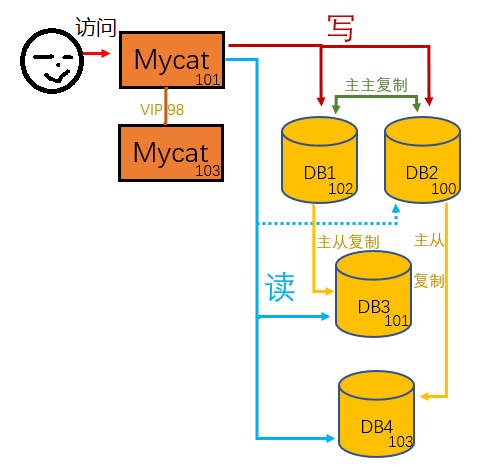
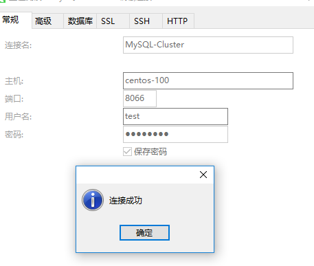
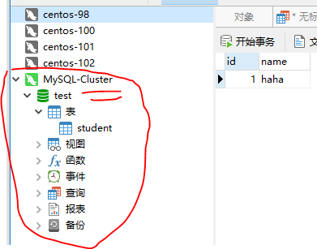

[安装 MySQL8](03-安装-MySQL8.md)

##### 1、安装环境与版本

4个CentOS 7 虚拟机 

4个MySQL8实例，双主双从

| centos-100      | centos-102      | centos-101     | centos-103 |
| --------------- | --------------- | -------------- | -------------- |
| mysql（master） | mysql（master） | mysql（slave） | mysql（slave） |
| keepalived      | keepalived      |                |                |
| mycat         | mycat  |                |                |


##### 2、主从复制

- **主节点（centos-100，centos-102）点配置**

  ```$ vi /etc/my.cnf```

  ```
  [mysqld]
  log-bin=mysql-bin #主节点需要开启二进制日志
  server-id=100 #注意不能相同
  ```


- **从节点（centos-101，centos-103）配置**

  ```$ vi /etc/my.cnf```


  ```
  [mysqld]
  server-id=101 #注意不能相同

  #replicate_wild_do_table=test.%                    #只同步test库下的表
  #relay_log=mysqld-relay-bin                        #记录中继日志
  #log-slave-updates=YES                             #从服务器同步后记录日志
  ```


- **创建用于复制操作的用户**

  连上主节点，在2个主节点创建一个用户repl，用于从节点链接主节点时使用。

  ```
  mysql> CREATE USER 'repl'@'192.168.200.%' IDENTIFIED WITH mysql_native_password BY 'repl';
  mysql> GRANT REPLICATION SLAVE ON *.* TO 'repl'@'192.168.200.%';
  mysql> flush privileges;
  ```

  在从节点用账户登陆测试一下能不能访问。

  重启主节点mysql :```service mysql restart```

- **获取** *主节点* **binary log文件名和位置（position）**

  ```
  mysql> SHOW MASTER STATUS;
  ```

  ```
  mysql> SHOW MASTER STATUS;
  +---------------+----------+--------------+------------------+-------------------+
  | File          | Position | Binlog_Do_DB | Binlog_Ignore_DB | Executed_Gtid_Set |
  +---------------+----------+--------------+------------------+-------------------+
  | binlog.000003 |      155 |              |                  |                   |
  +---------------+----------+--------------+------------------+-------------------+
  1 row in set (0.01 sec)
  ```

  

- **在从（Slave）节点上设置主节点参数**

  ```
  mysql> CHANGE MASTER TO
  MASTER_HOST='192.168.200.100', #注意修改，从填对应的主机
  MASTER_USER='repl',
  MASTER_PASSWORD='repl',
  MASTER_LOG_FILE='binlog.000003', #注意修改，填对应的主机
  MASTER_LOG_POS=155; #注意修改，填对应的主机
  ```

  开启主从同步

  ```
  mysql> start slave;
  ```
  查看主从同步状态

  ```
  mysql> show slave status\G;
  ```

  两个参数都是yes说明从服务器配置成功

  ```
  Slave_IO_Running: Yes
  Slave_SQL_Running: Yes
  ```

- 出现错误：

  ```
  Slave_IO_Running: no
  Slave_SQL_Running: Yes
  ```

  1）日志报错：

  [The slave I/O thread stops because master and slave have equal MySQL server UUIDs; these UUIDs must be different for replication to work](https://blog.csdn.net/cug_jiang126com/article/details/46846031)

  查看server_uuid：

  ```
  mysql> show variables like '%server_uuid%'
  ```

  发现各个服务器server_uuid确实相同。猜测可能是复制的虚拟机的缘故。

  找到data文件夹下的auto.cnf文件，修改里面的uuid值，保证各个db的uuid不一样，重启db

  ```$ vi /usr/java/mysql/data/auto.cnf```

  2）日志报错：

  [Got fatal error 1236 from master when reading data from binary log: 'Could not find first log file name in binary log index file'](https://www.cnblogs.com/xiaoit/p/4489643.html)

  ```
  mysql> stop slave;
  mysql> reset slave;
  mysql> start slave;
  ```

- 测试

  在主节点执行sql语句，可以发现同步到了从节点。

  ```
  mysql> create database test;
  mysql> show databases;
  ```

  centos-100 → 103， centos102→101分别建立了主从同步

##### 3、主主复制

主主复制即两个节点互为主从。

```$ vi /etc/my.cnf```


centos-100:

```
log-bin=mysql-bin #主节点需要开启二进制日志
auto_increment_increment=2         #步进值auto_imcrement。一般有n台主MySQL就填n
auto_increment_offset=1            #起始值。一般填第n台主MySQL。此时为第一台主MySQL
log-slave-updates=on #同步数据也写日志，让从机也能继续同步实现 102→100→103
```

centos-102:

```
log-bin=mysql-bin #主节点需要开启二进制日志，
auto_increment_increment=2         #步进值auto_imcrement。一般有n台主MySQL就填n
auto_increment_offset=2            #起始值。一般填第n台主MySQL。此时为第二台主MySQL
log-slave-updates=on #同步数据也写日志，让从机也能继续同步实现 102→100→103
```

设置了步进和起始值，这样在自增id的时候就不会冲突了。

再按照第二步的主从复制将centos-100，centos-102互相配置成主从同步


重启两个主节点：```$ service mysql restart```

在两个主节点分别插入数据，所有节点都能查到数据。


##### 5、读写分离

[MyCAT](https://www.biaodianfu.com/mycat.html)
```$ cd /usr/java```
```$ wget http://dl.mycat.io/1.6.6.1/Mycat-server-1.6.6.1-release-20181031195535-linux.tar.gz```

```$ tar -zxvf Mycat-server-1.6.6.1-release-20181031195535-linux.tar.gz```

```$ vi ./mycat/conf/server.xml```

```
<user name="test" defaultAccount="true">
    <property name="password">test</property>
    <property name="schemas">springboot</property>
</user>
```

```$ vi ./mycat/conf/schema.xml```

```
<?xml version="1.0"?>
<!DOCTYPE mycat:schema SYSTEM "schema.dtd">
<mycat:schema xmlns:mycat="http://io.mycat/">

	<schema name="springboot" checkSQLschema="true" sqlMaxLimit="100" dataNode="dn1"></schema>
	
	<dataNode name="dn1" dataHost="centos" database="springboot" />
	
	<dataHost name="centos" maxCon="1000" minCon="10" balance="1"
			  writeType="0" dbType="mysql" dbDriver="jdbc" switchType="2"  slaveThreshold="100">
		<heartbeat>show slave status</heartbeat>
		
		<writeHost host="Master1" url="jdbc:mysql://centos-100:3306?useSSL=false&amp;serverTimezone=UTC" user="panqt" password="panqt">
			<readHost host="Slave1" url="jdbc:mysql://centos-103:3306?useSSL=false&amp;serverTimezone=UTC" user="panqt" password="panqt" />
		</writeHost>
		<writeHost host="Master2" url="jdbc:mysql://centos-102:3306?useSSL=false&amp;serverTimezone=UTC" user="panqt" password="panqt">
			<readHost host="Slave2" url="jdbc:mysql://centos-101:3306?useSSL=false&amp;serverTimezone=UTC" user="panqt" password="panqt" />
		</writeHost>
	</dataHost>
</mycat:schema>
```
```$ vi /usr/java/mycat/conf/wrapper.conf```
```
wrapper.java.command=/usr/java/jdk/bin/java
```
替换jar包
```$ cd /usr/java/mycat/lib```
```$ wget http://central.maven.org/maven2/mysql/mysql-connector-java/8.0.11/mysql-connector-java-8.0.11.jar```
```$ rm -f mysql-connector-java-5.1.35.jar```

启动：```$ /usr/java/mycat/bin/mycat start```

```$ mysql -hcentos-100 -P9066 -utest -ptest --default_auth=mysql_native_password```

[Mycat Mysql8.0配置详情](https://blog.csdn.net/yangshuai518/article/details/81589349?utm_source=blogxgwz9)

[Mycat连接Mysql 8时的注意事项](https://www.cnblogs.com/wggj/p/10027681.html)





mycat添加到服务：

```$ ln -s /usr/java/mycat/bin/mycat /etc/init.d/mycat ```

```$ chkconfig mycat on```

```$ sudo firewall-cmd --zone=public --add-port=8066/tcp --permanent ```

```sudo firewall-cmd --zone=public --add-port=9066/tcp --permanent```

重启：```$ sudo firewall-cmd --reload```

```

balance="1"，全部的 readHost 与 stand by writeHost (空闲写) 参与 select 语句的负载均衡，简单的说，当双主双从模式(M1->S1，M2->S2，并且 M1 与 M2 互为主备)，正常情况下，在M1写，M2,S1,S2 都参与 select 语句的负载均衡。 

writeType="0", 所有写操作发送到配置的第一个 writeHost，第一个挂了切到还生存的第二个writeHost，重新启动后已切换后的为准，切换记录在配置文件中:dnindex.properties

switchType="2" 基于 MySQL 主从同步的状态决定是否切换，心跳语句为 show slave status
经测试：当 Master1 挂掉后，会让 Master2 成为主写，并且不再读 Slave1
switchType="1" 默认值，自动切换
发现 与switchType="2"效果一样
switchType="3" 默认值，自动切换 心跳语句为 show status like 'wsrep%'
发现 与switchType="2"效果一样

```


##### 6、Mycat+keepalived高可用，
参考：[Nginx+Keepalived整合](17-Nginx+Keepalived-实现主备切换.md)

```$ vi /etc/keepalived/check_mycat_alive.sh```

```
#!/bin/bash
if [ "$(ps -ef | grep "io.mycat.MycatStartup start"| grep -v grep )" == "" ]
    then
        service keepalived stop
        service mycat start
        sleep 5
    if [ "$(ps -ef | grep "io.mycat.MycatStartup start"| grep -v grep )" != "" ]
        then
            service keepalived start
    fi
fi
```

```$ chmod 755 /etc/keepalived/check_mycat_alive.sh```

```$ vi /etc/keepalived/keepalived.conf```

```
vrrp_script check_mycat_alive {
        script "/etc/keepalived/check_mycat_alive.sh"   
        interval 2   
        weight -10  
}

vrrp_instance mycat_ha {
    state MASTER 
    interface eno16777736 
    virtual_router_id 40
    priority 102       
    advert_int 1        
    authentication {
        auth_type PASS 
        auth_pass 1111 
    }
    virtual_ipaddress {
        192.168.200.97/24 dev eno16777736
    }
	track_script {
		check_mycat_alive
	}
}
```


[MySQL企业常用集群图解](https://www.cnblogs.com/yangliheng/p/5871208.html)

[同步初态](https://www.cnblogs.com/ahaii/p/6307648.html)

[MySQL 8.0主从（Master-Slave）配置](https://blog.csdn.net/zyhlwzy/article/details/80569422)

[MYSQL主从复制、主主复制、双主多从配置](https://www.cnblogs.com/gspsuccess/p/9182545.html)
